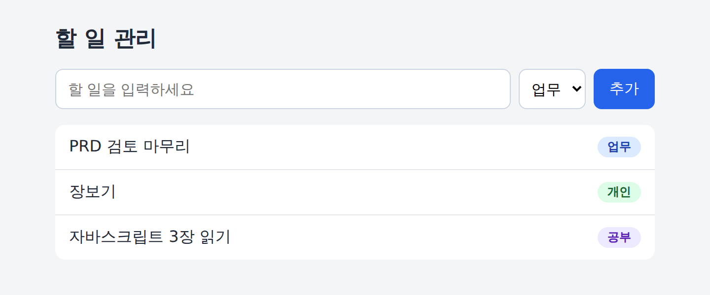

# Study02_ToDoList

하루 10~20개의 할 일을 적어 두고, 카테고리로 나눠 보면서 완료 여부와 진행률을 확인하는 개인용 할 일 관리 앱이다.

서버도 계정도 빌드 도구도 없다. HTML 파일 하나를 브라우저로 열면 실행되고, 데이터는 브라우저의 `localStorage`에 남는다.

**배포 주소**: https://kimlooa1004-blip.github.io/Study02_ToDoList/

## 현재 상태

**1~2단계까지 구현했다.** 할 일을 추가하고 카테고리(업무·개인·공부)를 붙일 수 있으며, 새로고침해도 목록이 남는다. 완료 체크, 삭제, 필터, 진행률, 수정은 다음 단계에서 추가한다.

| 단계 | 내용 | 상태 |
|---|---|---|
| 1 | 뼈대와 저장 계층 | 완료 |
| 2 | 할 일 추가 | 완료 |
| 3 | 완료 체크와 삭제 | 예정 |
| 4 | 필터와 진행률 | 예정 |
| 5 | 수정과 마무리 | 예정 |

## 기능

지금 되는 것:

- 할 일 추가 (Enter 또는 추가 버튼). 최근에 추가한 항목이 맨 위에 온다
- 카테고리 분류: 업무 / 개인 / 공부 (색 배지로 구분)
- `localStorage`에 자동 저장. 저장된 데이터가 깨졌으면 안내 문구를 보이고 빈 목록으로 시작한다

PRD에 있고 아직 안 된 것: 수정, 삭제, 완료 체크, 카테고리 필터, 진행률 보기.

자세한 요구사항과 완료 기준은 [PRD.md](./PRD.md)에 있다.

## 기술 스택

- HTML, CSS, 순수 자바스크립트
- 라이브러리와 프레임워크 없음
- 파일 구성: `index.html` 하나 (CSS와 자바스크립트를 같은 파일 안에 둔다)

## 실행 방법

- **배포 주소로 열기**: 위 주소에 접속한다.
- **내 컴퓨터에서 열기**: `index.html`을 브라우저로 연다. 설치할 것도, 띄울 서버도 없다.

## 파일

| 파일 | 내용 |
|---|---|
| `index.html` | 앱 전체 (HTML, CSS, 자바스크립트) |
| `PRD.md` | 제품 요구사항 문서 |
| `PROMPTS.md` | PRD를 클로드 코드에서 실행할 5단계 프롬프트로 나눈 구현 계획서 |
| `README-v1.md` | 요구사항 정의만 끝났을 때의 README (보존용) |
| `ToDoList_v1.png` | 앱 화면 캡처 |

## 데이터 저장 방식

- 데이터는 사용 중인 브라우저의 `localStorage`(키: `todo-app-v1`)에만 저장된다. 서버로 보내지 않는다.
- 브라우저와 기기마다 데이터가 따로다. 사이트 데이터를 지우거나 시크릿 창을 쓰면 목록이 사라진다.

## GitHub Pages로 배포하기

1. 저장소 **Settings → Pages**로 이동한다.
2. Source는 `Deploy from a branch`, Branch는 `main` / `/ (root)`로 두고 **Save**를 누른다.
3. 1~2분 뒤 위의 배포 주소로 접속된다.

## 배경

클로드에게 PRD를 쓰게 하고, 그 PRD를 바탕으로 구현까지 진행하는 과정을 담는다.
