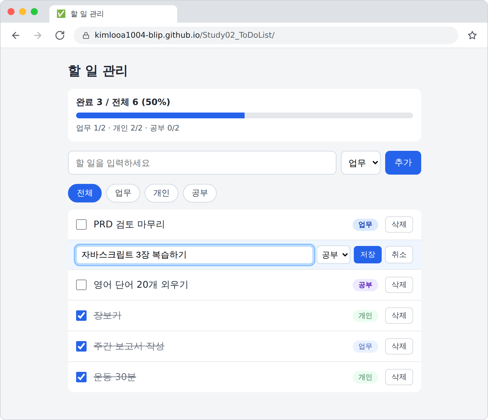

# Study02_ToDoList

하루 10~20개의 할 일을 적어 두고, 카테고리로 나눠 보면서 완료 여부와 진행률을 확인하는 개인용 할 일 관리 앱이다.

서버도 계정도 빌드 도구도 없다. HTML 파일 하나를 브라우저로 열면 실행되고, 데이터는 브라우저의 `localStorage`에 남는다.

**배포 주소**: https://kimlooa1004-blip.github.io/Study02_ToDoList/

## 현재 상태

**PRD의 필수 기능(P0)을 모두 구현했고, 인수 기준 12개를 통과했다.** 할 일을 추가·수정·삭제하고 완료 체크를 하며, 업무·개인·공부로 분류해 걸러 보고, 전체와 카테고리별 진행률을 확인한다. 새로고침이나 브라우저 재시작 후에도 목록, 체크 상태, 선택한 탭이 남는다. 선택 기능(P1)인 완료 항목 일괄 삭제와 내보내기/가져오기는 만들지 않았다.

| 단계 | 내용 | 상태 |
|---|---|---|
| 1 | 뼈대와 저장 계층 | 완료 |
| 2 | 할 일 추가 | 완료 |
| 3 | 완료 체크와 삭제 | 완료 |
| 4 | 필터와 진행률 | 완료 |
| 5 | 수정과 마무리 | 완료 |

## 기능

지금 되는 것:

- 할 일 추가 (Enter 또는 추가 버튼). 최근에 추가한 항목이 맨 위에 온다
- 카테고리 분류: 업무 / 개인 / 공부 (색 배지로 구분)
- 완료 체크: 체크하면 취소선이 생기고 완료 묶음(목록 아래쪽)으로 내려간다. 체크를 풀면 원래 자리로 돌아온다
- 삭제: 삭제 버튼을 누르면 확인 창 없이 바로 지운다
- 카테고리 필터: 전체 / 업무 / 개인 / 공부 탭. 선택한 탭은 새로고침해도 유지된다
- 진행률: "완료 3 / 전체 6 (50%)" 문구와 막대, 카테고리별 완료 수. 필터와 관계없이 항상 **전체 목록 기준**으로 계산한다
- 지금 보는 탭에 안 보일 카테고리로 추가하면 전체 탭으로 돌아가서, 방금 추가한 항목이 사라진 것처럼 보이지 않는다
- 키보드만으로 추가·체크·삭제·탭 전환이 가능하다 (Tab, Space, Enter). 한글 입력 중 Enter는 저장으로 처리하지 않는다
- `localStorage`에 자동 저장. 저장된 데이터가 깨졌으면 안내 문구를 보이고 빈 목록으로 시작한다

- 수정: 항목 글자를 더블클릭하면 글과 카테고리를 고칠 수 있다. Enter 또는 저장 버튼으로 저장하고, Esc 또는 취소 버튼으로 취소한다. 빈 글로 저장하면 수정이 취소된다

아직 안 만든 것(선택 기능 P1): 완료 항목 일괄 삭제(F9), 내보내기/가져오기(F10).

자세한 요구사항과 완료 기준은 [PRD.md](./PRD.md)에 있다.

## 인수 기준 점검 결과

[PRD](./PRD.md)의 「인수 기준과 수동 테스트」 12개를 브라우저 자동화(Playwright, Chromium)로 직접 조작해서 확인했다. 1~5단계별 자동 검증도 모두 통과했다. 사람이 하는 마지막 확인은 배포 주소에서 직접 해 본다.

| 번호 | 확인 내용 | 결과 |
|---|---|---|
| 1 | Enter로 추가하면 맨 위에 들어가고 입력칸이 비워진다 | 통과 |
| 2 | 공백만 입력하면 추가되지 않는다 | 통과 |
| 3 | 더블클릭으로 수정, Enter 저장, Esc 취소, 빈 값 저장은 취소 | 통과 |
| 4 | 삭제 버튼을 누르면 즉시 사라진다 | 통과 |
| 5 | 체크하면 취소선이 생기고 다시 누르면 원래대로 돌아온다 | 통과 |
| 6 | 12개 중 7개를 체크하면 "완료 7 / 전체 12 (58%)"가 보인다 | 통과 |
| 7 | 항목이 0개일 때 "할 일을 추가하세요"가 보이고 오류가 없다 | 통과 |
| 8 | 업무 탭을 누르면 업무만 보이고 진행률은 전체 기준 그대로다 | 통과 |
| 9 | 새로고침하면 항목·완료 상태·카테고리·선택한 탭이 모두 유지된다 | 통과 |
| 10 | 브라우저를 닫았다 다시 열어도 데이터가 있다 | 통과 |
| 11 | `<b>테스트</b>`를 입력하면 태그 문자가 그대로 보인다 | 통과 |
| 12 | 20개를 입력해도 화면이 느려지거나 레이아웃이 깨지지 않는다(200개에서 추가 1회 갱신 100ms 이하) | 통과 |

## 기술 스택

- HTML, CSS, 순수 자바스크립트
- 라이브러리와 프레임워크 없음
- 파일 구성: `index.html` 하나 (CSS와 자바스크립트를 같은 파일 안에 둔다)

## 실행 방법

- **배포 주소로 열기**: 위 주소에 접속한다.
- **내 컴퓨터에서 열기**: `index.html`을 브라우저로 연다. 설치할 것도, 띄울 서버도 없다.

## 파일

| 파일 | 내용 |
|---|---|
| `index.html` | 앱 전체 (HTML, CSS, 자바스크립트) |
| `PRD.md` | 제품 요구사항 문서 |
| `PROMPTS.md` | PRD를 클로드 코드에서 실행할 5단계 프롬프트로 나눈 구현 계획서 |
| `README-v1.md` | 요구사항 정의만 끝났을 때의 README (보존용) |
| `README-v2.md` | 1~2단계까지 구현했을 때의 README (보존용) |
| `README-v3.md` | 1~3단계까지 구현했을 때의 README (보존용) |
| `README-v4.md` | 1~4단계까지 구현했을 때의 README (보존용) |
| `ToDoList_v1.png` | 2단계 시점의 앱 화면 캡처 |
| `ToDoList_v2.png` | 3단계 시점의 앱 화면 캡처 |
| `ToDoList_v3.png` | 4단계 시점의 앱 화면 캡처 |
| `ToDoList_v4.png` | 5단계(완성) 시점의 앱 화면 캡처. 한 항목을 수정하는 중인 모습 |

## 데이터 저장 방식

- 데이터는 사용 중인 브라우저의 `localStorage`(키: `todo-app-v1`)에만 저장된다. 서버로 보내지 않는다.
- 브라우저와 기기마다 데이터가 따로다. 사이트 데이터를 지우거나 시크릿 창을 쓰면 목록이 사라진다.

## GitHub Pages로 배포하기

1. 저장소 **Settings → Pages**로 이동한다.
2. Source는 `Deploy from a branch`, Branch는 `main` / `/ (root)`로 두고 **Save**를 누른다.
3. 1~2분 뒤 위의 배포 주소로 접속된다.

## 배경

클로드에게 PRD를 쓰게 하고, 그 PRD를 바탕으로 구현까지 진행하는 과정을 담는다.
